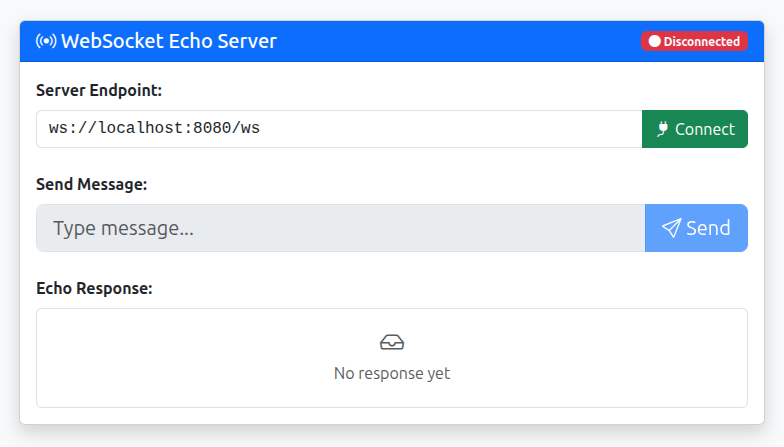
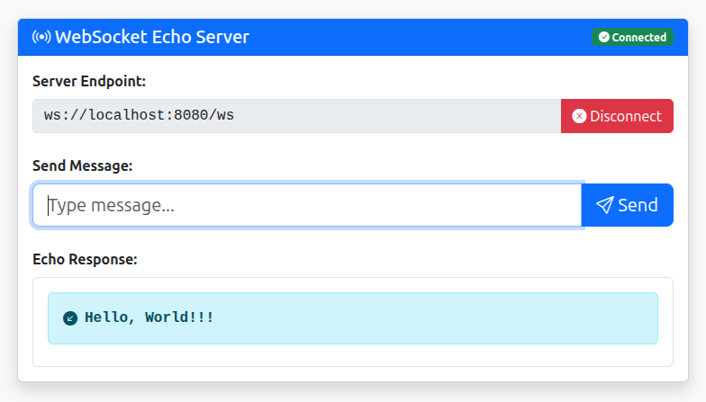

# Go WebSocket Echo Server

A simple WebSocket echo server in Go using the Gorilla WebSocket library. This project serves as a practical example for learning WebSockets.

## 🏃 Running the Application

### Option 1: Local Go Environment

1.  Run the Go application:
    ```
    go run main.go
    ```

2.  Open your browser and navigate to:
    `http://localhost:8080`

### Option 2: Using Docker

This method builds a Docker image and runs the application in a container.

1.  Build the Docker image:
    ```
    docker build -t websocket-echo .
    ```

2.  Run the container:
    ```
    docker run -p 8080:8080 --name echo-server websocket-echo
    ```

3.  Access the application at `http://localhost:8080`.

## 📸 Screenshots



